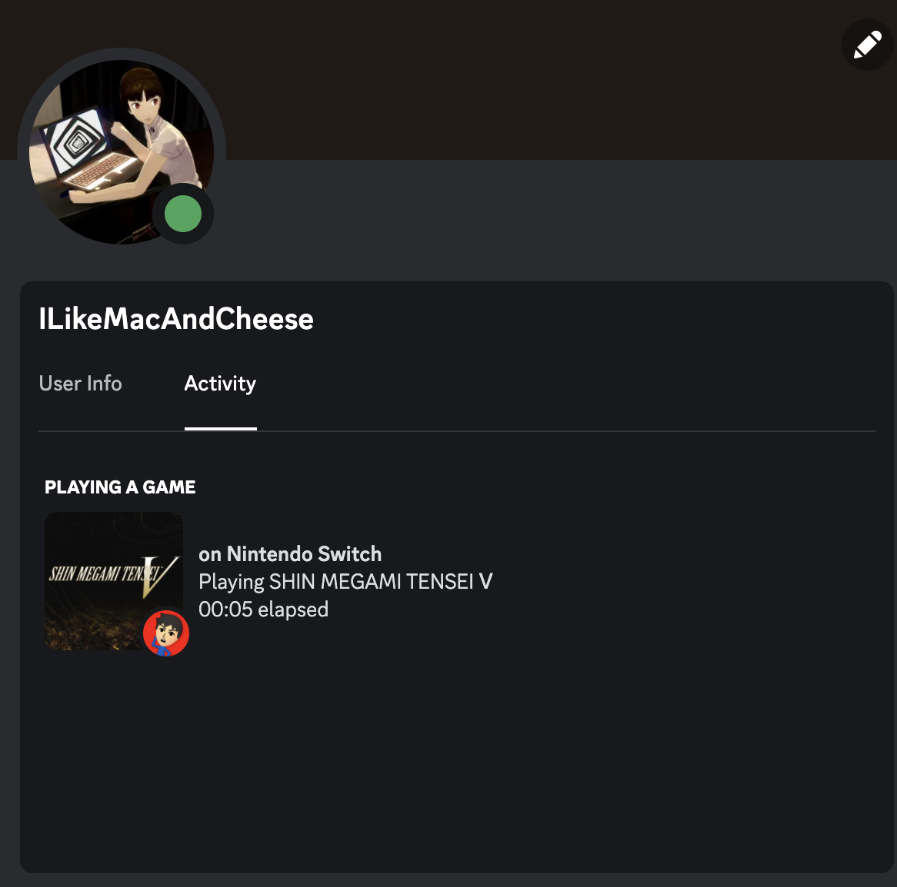

# nxsence
## Discord Rich Presence for Nintendo Switch

[](https://github.com/qwertyquerty/pypresence)



nxsence is a user-friendly way to automatically share what you're playing on Nintendo Switch with your friends on Discord!

[ZekeSnyder's Reverse Engineered Nintendo Switch App API]:<https://github.com/ZekeSnider/NintendoSwitchRESTAPI>

[JoneWang's f API]:<https://github.com/imink-app/f-API>

[pypresence]:<https://github.com/qwertyquerty/pypresence>

## Installation
Clone this repository
```sh
git clone https://github.com/tedkim7/nxsence
```
(MacOS/Linux) Open Terminal from your clone and then install the requirements
```sh
pip install -r requirements.txt
```
followed by
```sh
chmod +x nxsence.py
```
And begin running nxsence with
```sh
./nxsence.py --help
```

## Getting Started
To start, make sure you have "Display current activity as a status message" toggled on in your Discord client (this can be found in Activity Privacy in the settings)

You'll need to register your first user. Run
```sh
./nxsence.py register
```
After registering, you can start sharing your status on Discord! Run
```sh
./nxsence.py discord [user you want to login to] [OPTIONAL: user you want to display, defaults to first specified user] [OPTIONAL: --log, creates a log that might be useful in debugging problems]
```
Because of the way the Nintendo Switch Online app works as of now, you CANNOT share your own status on your own account as you will be shown to be always offline, which will be very sad. You can go around this by logging onto an account that is friends with the account whose status you wish to share, so I can share IEatMacAndCheese's status by logging into their friend IEatWaffles' account:
```sh
./nxsence.py discord IEatWaffles IEatMacAndCheese
```
For accounts with special characters that might be difficult to type in, you can copy-paste them from calling
```sh
./nxsence.py accounts
```
which displays all the names of the registered users or
```sh
./nxsence.py friends [user]
```
which displays all the names of the friends of user.

Have fun!

## Credits
This project would not have been possible without these indispensible resources:
- [ZekeSnyder's Reverse Engineered Nintendo Switch App API] for the incredible documentation of the NSO mobile app's REST APIs.
- [JoneWang's f API] for the crucial task of generating f parameters necessary for logging in.
- [pypresence] for integration with the Discord client.